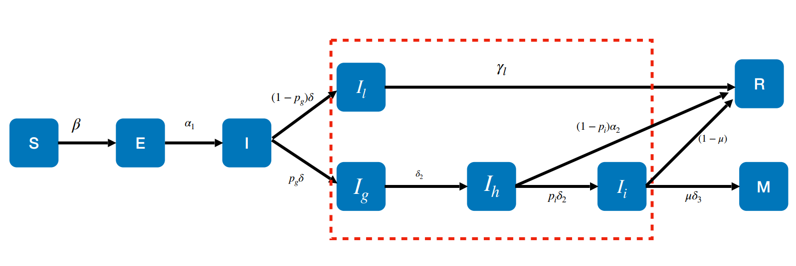
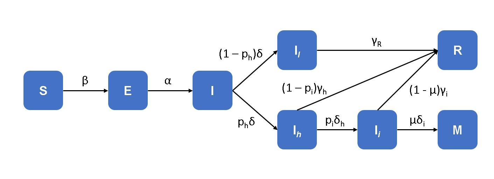
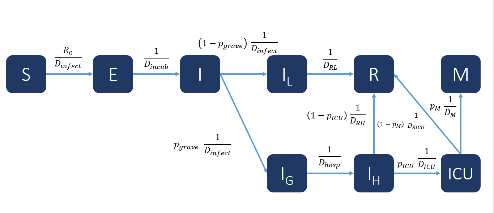
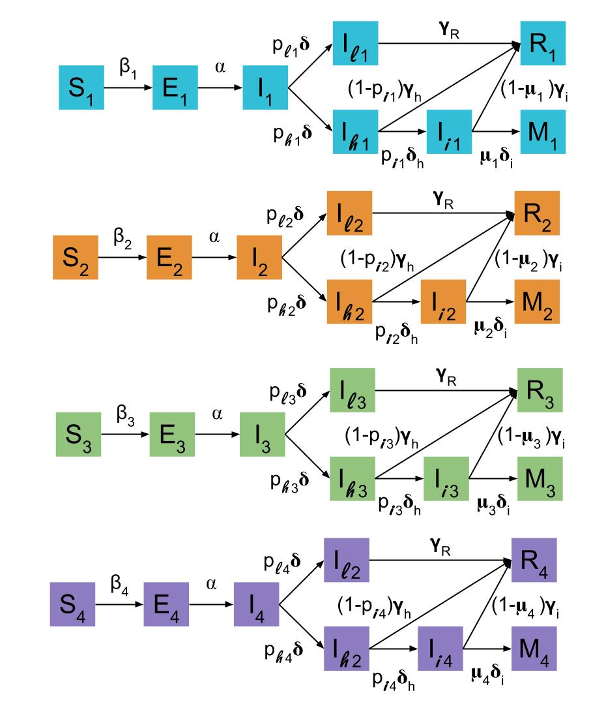

# Modelo inicial

## Diagrama por compartimentos

Modelo generado por Roberto Álvarez para la dinámica de COVID-19 en la ciudad de Querétaro con base en el modelo epidemiológico de la Ciudad de México.



## Inferir los parámetros y variables

+ Parámetros

+----------------+------------------------------------------------------------+
| Parámetros     | Significado                                                |
+================+============================================================+
| $\beta$        | Tasa de infección por la interacción $SI$ |
+----------------+------------------------------------------------------------+
| $\alpha _1$    | Tasa/Tiempo a la que los individuos infectados expuestos se vuelven infectados infectantes | 
+----------------+------------------------------------------------------------+
| $\delta$       | Tasa/Tiempo a la que los individuos infectados se vuelven infectados leves o infectados graves |
+----------------+------------------------------------------------------------+
| $p_g$          | Fracción de individuos infectados que se vuelven graves $0 \le p_g \le 1$ |
+----------------+------------------------------------------------------------+
| $(1-p_g)$      | Resto de individuos infectados que no se vuelven graves, se vuelven infectados leves |
+----------------+------------------------------------------------------------+
| $\gamma _1$    | Tasa/Tiempo en la que los individuos infectados leves se recuperan |
+----------------+------------------------------------------------------------+
| $\delta _2$    | Tasa/Tiempo a la que los individuos infectados graves son hospitalizados |
+----------------+------------------------------------------------------------+
| $\alpha _2$    | Tasa/Tiempo a la que los individuos hospitalizados se recuperan |
+----------------+------------------------------------------------------------+
| $p_i$          | Fracción de individuos hospitalizados que son intubados $0 \le p_i \le 1$ |
+----------------+------------------------------------------------------------+
| $(1-p_i)$      | Resto de individuos hospitalizados que no son intubados, se recuperan | 
+----------------+------------------------------------------------------------+
| $\delta _2$    | Tasa/Tiempo a la que los individuos hospitalizados son intubados | 
+----------------+------------------------------------------------------------+
| $\mu$          | Fracción de individuos intubados que mueren $0 \le \mu \le 1$ |
+----------------+------------------------------------------------------------+
| $(1-\mu)$      | Resto de individuos intibados que no mueren, se recuperan |
+----------------+------------------------------------------------------------+
| $\delta _3$    | Tasa/Tiempo a la que los individuos intubados mueren |
+----------------+------------------------------------------------------------+

+ Variables

- $S$ : individuos suceptibles
- $E$ : individuos expuestos infectados pero no infectantes
- $I$ : individuos infectados que son infectantes
- $I_l$ : individuos infectados leves
- $I_g$ : individuos infectados graves
- $I_h$ : individuos infectados hospitalizados
- $I_i$ : individuos infectados intubados
- $R$ : individuos recuperados
- $M$ : individuos muertos

# Modificación del modelo

## Diagrama por compartimentos



## Inferencia de parámetros y variables

+ Parámetros

+----------------+------------------------------------------------------------+
| Parámetros     | Significado                                                |
+================+============================================================+
| $\beta$        | Tasa de infección por la interacción $SI$ |
+----------------+------------------------------------------------------------+
| $\alpha$       | Tasa/Tiempo a la que los individuos infectados expuestos se vuelven infectados infectantes | 
+----------------+------------------------------------------------------------+
| $\delta$       | Tasa/Tiempo a la que los individuos infectados se vuelven infectados leves o infectados hospitalizados |
+----------------+------------------------------------------------------------+
| $p_h$          | Fracción de individuos infectados que son hospitalizados $0 \le p_g \le 1$ |
+----------------+------------------------------------------------------------+
| $(1-p_h)$      | Resto de individuos infectados que no son hospitalizados, se vuelven infectados leves |
+----------------+------------------------------------------------------------+
| $\gamma _R$    | Tasa/Tiempo en la que los individuos infectados leves se recuperan |
+----------------+------------------------------------------------------------+
| $\gamma _h$    | Tasa/Tiempo a la que los individuos hospitalizados se recuperan |
+----------------+------------------------------------------------------------+
| $p_i$          | Fracción de individuos hospitalizados que son intubados $0 \le p_i \le 1$ |
+----------------+------------------------------------------------------------+
| $(1-p_i)$      | Resto de individuos hospitalizados que no son intubados, se recuperan | 
+----------------+------------------------------------------------------------+
| $\delta h$     | Tasa/Tiempo a la que los individuos hospitalizados son intubados 
+----------------+------------------------------------------------------------+
| $\mu$          | Fracción de individuos intubados que mueren $0 \le \mu \le 1$ |
+----------------+------------------------------------------------------------+
| $(1-\mu)$      | Resto de individuos intubados que no mueren, se recuperan |
+----------------+------------------------------------------------------------+
| $\delta _i$    | Tasa/Tiempo a la que los individuos intubados mueren |
+----------------+------------------------------------------------------------+
| $\gamma _i$    | Tasa/Tiempo a la que los individuos intubados se recuperan |
+----------------+------------------------------------------------------------+

+ Variables

- $S$ : individuos suceptibles
- $E$ : individuos expuestos infectados pero no infectantes
- $I$ : individuos infectados que son infectantes
- $I_l$ : individuos infectados leves
- $I_h$ : individuos infectados hospitalizados
- $I_i$ : individuos infectados intubados
- $R$ : individuos recuperados
- $M$ : individuos muertos

## Ecuaciones

$$\begin{array}{l}
\dot S = -\beta SI \\
\dot E = \beta SI - \alpha E \\
\dot I = \alpha E - p_h\delta I - (1-p_h)\delta I \\
\dot I_l = (1-p_h)\delta I - \gamma _R I_l \\
\dot I_h = p_h\delta I - p_i\delta _h I_h - (1-p_i)\gamma _h I_h \\
\dot I_i = p_i\delta _h I_h - \mu \delta _i I_i - (1-\mu)\gamma _i I_i \\
\dot M = \mu \delta _i I_i \\ 
\dot R = \gamma _R I_l + (1-p_i)\gamma _h I_h + (1-\mu)\gamma _i I_i
\end{array}$$

# Definiciones de categorías y parámetros

## Diagrama de compartimentos

Para la definición de los parámetros y categorías se tomó como base el modelo de la CDMX



## Categorías

```{r warning=FALSE, message=FALSE}
# source("02_Scripts/Script.R")
#t<-cbind(p_p, p_l, p_h, p_i, p_m)
#colnames(t) <- c("S -> I", "I -> L", "I -> G", "G -> ICU", "ICU -> M")
print(t)

### IGNORAR EL HEATMAP Y EL DENDOGRAMA ... POR EL MOMENTO
```

Con base en las probabilidades de transición para cada uno de los estados de enfermedad (variables), se definen las categorias de grupos de edad. 

+ **Categoría 1** : Personas menores de 18 años, Personas de 18 a 29 años, Personas de 30 a 29 años.
+ **Categoría 2** : Personas de 40 a 49 años, Personas de 50 a 59 años.
+ **Categoría 3** : Personas de 60 a 69 años, Personas mayores a 79 años.

## Parámetros

Los parámetros serían las probabilidades de transición de cada una de las variables. 

```{r}
print(t)
```

## Tabla de Probabilidades

```{r}
# source("02_Scripts/Script.R")
#p_t <- cbind(p_p, p_l, p_h, p_i, p_m)
#colnames(p_t) <- c("Suceptible --> Infectado",
#                      "Infectado --> Ambulatorio",
#                      "Infectado --> Grave",
#                      "Grave --> ICU",
#                      "ICU --> Muerte")
print(p_t)
```

## Correlación de probabilidades
```{r}
heatmap(cor(t(p_t)))
```

De acuerdo a las categorias obtenidas por el heatmap, podemos definir los grupoes de acuerdo a: 

+ **Grupo 1** : Personas 30-39, Personas 40-49.
+ **Grupo 2** : Personas -18, Personas 18-29
+ **Grupo 3** : Personas 50-59
+ **Grupo 4** : Personas 60-69
+ **Grupo 5** : Personas 70+

## Analisis de clusters
```{r}
library(ape)
d_p_t <- dist(p_t)
clu <- hclust(d_p_t, method = "complete", members = NULL)
clu_p <- plot ( as.phylo  (clu), type = "phylogram" )
```

De acuerdo al dendograma obtenido por el análisis de clusters, podemos definir los grupos de acuerdo a:

+ **Grupo 1** : Personas 60-69, Personas 50-59.
+ **Grupo 2** : Personas 70+
+ **Grupo 3** : Personas 40-49, Personas 30-39
+ **Grupo 4** : Personas 18-29, Personas -18

Para el desarrollo de este modelo, se decidió tomar esta última clasificación. 

Para comprobar que los grupos definidos por el análisis de clúster son robustos, se realizó el análisis por distintos métodos de clustering.

```{r}
agroup1 <- hclust(d_p_t, method = "complete", members = NULL)
agroup2 <- hclust(d_p_t, method = "ward.D", members = NULL)
agroup3 <- hclust(d_p_t, method = "ward.D2", members = NULL)
agroup4 <- hclust(d_p_t, method = "single", members = NULL)
agroup5 <- hclust(d_p_t, method = "average", members = NULL)
agroup6 <- hclust(d_p_t, method = "mcquitty", members = NULL)
agroup7 <- hclust(d_p_t, method = "median", members = NULL)
agroup8 <- hclust(d_p_t, method = "median", members = NULL)
agroup9 <- hclust(d_p_t, method = "centroid", members = NULL)
#   3) Graficar usando la funcion: plot ()
#      Para visualizar llos analisis usando layout
layout ( matrix ( c( 1 : 9 ), 3, 3))
plot(agroup1)
plot(agroup2) 
plot(agroup3)
plot(agroup4)
plot(agroup5) 
plot(agroup6) 
plot(agroup7)
plot(agroup8)
plot(agroup9)
layout(matrix (c (1), 1, 1))
```

Aunque algunos métodos se obtienen resultados distintos, al menos tres métodos concuerdan con los grupos previamente definidos, así que se eligió trabajar con esta clasificación. Además de que es la que menos grupos tiene y facilitará el análisis del modelo posteriormente. 

# Ecuaciones

Para establecer el modelo, se tomará como referencia el modelo modificado a partir del modelo establecido por Roberto Álvarez para el Estado de Querétaro, al que se le agregó la estructura de edad definida por los grupos previamente obtenidos, definido a los cuatro compartimentos 

+ **Grupo 1** : Personas -18, Personas 18-29
+ **Grupo 2** : Personas 30-39, Personas 40-49
+ **Grupo 3** : Personas 50-59, Personas 60-69
+ **Grupo 4** : Personas 70+



+ Parámetros

+----------------+------------------------------------------------------------+
| Parámetros     | Significado                                                |
+================+============================================================+
| $\beta$        | Tasa de infección por la interacción $SI$ **Este parámetro tiene estructura de edad** |
+----------------+------------------------------------------------------------+
| $\alpha$       | Tasa/Tiempo a la que los individuos infectados expuestos se vuelven infectados infectantes | 
+----------------+------------------------------------------------------------+
| $\delta$       | Tasa/Tiempo a la que los individuos infectados se vuelven infectados leves o infectados hospitalizados |
+----------------+------------------------------------------------------------+
| $p_h$          | Fracción de individuos infectados que son hospitalizados $0 \le p_g \le 1$ **Este parámetro tiene estructura de edad** |
+----------------+------------------------------------------------------------+
| $p_l$          | Fracción de individuos infectados que no son hospitalizados, se vuelven infectados leves **Este parámetro tiene estructura de edad** |
+----------------+------------------------------------------------------------+
| $\gamma _R$    | Tasa/Tiempo en la que los individuos infectados leves se recuperan |
+----------------+------------------------------------------------------------+
| $\gamma _h$    | Tasa/Tiempo a la que los individuos hospitalizados se recuperan |
+----------------+------------------------------------------------------------+
| $p_i$          | Fracción de individuos hospitalizados que son intubados $0 \le p_i \le 1$ **Este parámetro tiene estructura de edad** |
+----------------+------------------------------------------------------------+
| $(1-p_i)$      | Resto de individuos hospitalizados que no son intubados, se recuperan | 
+----------------+------------------------------------------------------------+
| $\delta h$     | Tasa/Tiempo a la que los individuos hospitalizados son intubados 
+----------------+------------------------------------------------------------+
| $\mu$          | Fracción de individuos intubados que mueren $0 \le \mu \le 1$ **Este parámetro tiene estructura de edad** |
+----------------+------------------------------------------------------------+
| $(1-\mu)$      | Resto de individuos intubados que no mueren, se recuperan |
+----------------+------------------------------------------------------------+
| $\delta _i$    | Tasa/Tiempo a la que los individuos intubados mueren |
+----------------+------------------------------------------------------------+
| $\gamma _i$    | Tasa/Tiempo a la que los individuos intubados se recuperan |
+----------------+------------------------------------------------------------+

+ Variables

- $S_1$ : individuos suceptibles del grupo 1
- $S_2$ : individuos suceptibles del grupo 2
- $S_3$ : individuos suceptibles del grupo 3
- $S_4$ : individuos suceptibles del grupo 4
- $E_1$ : individuos expuestos infectados pero no infectantes del grupo 1
- $E_2$ : individuos expuestos infectados pero no infectantes del grupo 2
- $E_3$ : individuos expuestos infectados pero no infectantes del grupo 3
- $E_4$ : individuos expuestos infectados pero no infectantes del grupo 4
- $I_1$ : individuos infectados que son infectantes del grupo 1
- $I_2$ : individuos infectados que son infectantes del grupo 2
- $I_3$ : individuos infectados que son infectantes del grupo 3
- $I_4$ : individuos infectados que son infectantes del grupo 4
- $I_l_1$ : individuos infectados leves del grupo 1
- $I_l_2$ : individuos infectados leves del grupo 2
- $I_l_3$ : individuos infectados leves del grupo 3
- $I_l_4$ : individuos infectados leves del grupo 4
- $I_h_1$ : individuos infectados hospitalizados del grupo 1
- $I_h_2$ : individuos infectados hospitalizados del grupo 2
- $I_h_3$ : individuos infectados hospitalizados del grupo 3
- $I_h_4$ : individuos infectados hospitalizados del grupo 4
- $I_i_1$ : individuos infectados intubados del grupo 1
- $I_i_2$ : individuos infectados intubados del grupo 2
- $I_i_3$ : individuos infectados intubados del grupo 3
- $I_i_4$ : individuos infectados intubados del grupo 4
- $R_1$ : individuos recuperados del grupo 1
- $R_2$ : individuos recuperados del grupo 2
- $R_3$ : individuos recuperados del grupo 3
- $R_4$ : individuos recuperados del grupo 4
- $M_1$ : individuos muertos del grupo 1
- $M_2$ : individuos muertos del grupo 2
- $M_3$ : individuos muertos del grupo 3
- $M_4$ : individuos muertos del grupo 4

## Ecuaciones

$$\begin{array}{l}
\text{Para el grupo 1 :} \\
\dot S_1 = -\beta_1 S_1 I_1 \\
\dot E_1 = \beta_1 S_1 I_1 - \alpha E_1 \\
\dot I_1 = \alpha E_1 - p_{h1} \delta I_1 - p_{l1} \delta I_1 \\
\dot I_{l1} = p_{l1}) \delta I_1 - \gamma _R I_{l1} \\
\dot I_{h1} = p_{h1} \delta I_1 - p_{i1} \delta _h I_{h1} - (1-p_{i1}) \gamma _h I_{h1} \\
\dot I_{i1} = p_{i1} \delta _h I_{h1} - \mu _1 \delta _i I_{i1} - (1-\mu_1)\gamma _i I_{i1} \\
\dot M_1 = \mu_1 \delta _i I_{i1} \\ 
\dot R_1 = \gamma _R I_{l1} + (1-p_{i1} ) \gamma _h I_{h1} + ( 1-\mu_1 ) \gamma _i I_{i1}
\\
\\
\text{Para el grupo 2 :} \\
\dot S_2 = -\beta_2 S_2 I_2 \\
\dot E_2 = \beta_2 S_2 I_2 - \alpha E_2 \\
\dot I_2 = \alpha E_2 - p_{h2} \delta I_2 - p_{l2} \delta I_2 \\
\dot I_{l2} = p_{l2} \delta I_2 - \gamma _R I_{l2} \\
\dot I_{h2} = p_{h2} \delta I_2 - p_{i2} \delta _h I_{h2} - (1-p_{i2}) \gamma _h I_{h2} \\
\dot I_{i2} = p_{i2} \delta _h I_{h2} - \mu _2 \delta _i I_{i2} - (1-\mu_2)\gamma _i I_{i2} \\
\dot M_2 = \mu_2 \delta _i I_{i2} \\ 
\dot R_2 = \gamma _R I_{l2} + (1-p_{i2} ) \gamma _h I_{h2} + ( 1-\mu_2 ) \gamma _i I_{i2}
\\
\\
\text{Para el grupo 3 :} \\
\dot S_3 = -\beta_3 S_3 I_3 \\
\dot E_3 = \beta_3 S_3 I_3 - \alpha E_3 \\
\dot I_3 = \alpha E_3 - p_{h3} \delta I_3 - p_{l3} \delta I_3 \\
\dot I_{l3} = p_{l3} \delta I_3 - \gamma _R I_{l3} \\
\dot I_{h3} = p_{h3} \delta I_3 - p_{i3} \delta _h I_{h3} - (1-p_{i3}) \gamma _h I_{h3} \\
\dot I_{i3} = p_{i3} \delta _h I_{h3} - \mu _3 \delta _i I_{i3} - (1-\mu_3)\gamma _i I_{i3} \\
\dot M_3 = \mu_3 \delta _i I_{i3} \\ 
\dot R_3 = \gamma _R I_{l3} + (1-p_{i3} ) \gamma _h I_{h3} + ( 1-\mu_3 ) \gamma _i I_{i3}
\\
\\
\text{Para el grupo 4 :} \\
\dot S_4 = -\beta_4 S_4 I_4 \\
\dot E_4 = \beta_4 S_4 I_4 - \alpha E_4 \\
\dot I_4 = \alpha E_4 - p_{h4} \delta I_4 - p_{l4} \delta I_4 \\
\dot I_{l4} = p_{l4} \delta I_4 - \gamma _R I_{l4} \\
\dot I_{h4} = p_{h4} \delta I_4 - p_{i4} \delta _h I_{h4} - (1-p_{i4}) \gamma _h I_{h4} \\
\dot I_{i4} = p_{i4} \delta _h I_{h4} - \mu _4 \delta _i I_{i4} - (1-\mu_4)\gamma _i I_{i4} \\
\dot M_4 = \mu_4 \delta _i I_{i4} \\ 
\dot R_4 = \gamma _R I_{l4} + (1-p_{i4} ) \gamma _h I_{h4} + ( 1-\mu_4 ) \gamma _i I_{i4}
\end{array}$$

## Parámetros obtenidos

Los parámetros obtenidos a usarse son las tasas a las que los individuos cambian de un compartimento a otro. 

```{r}
p_t

# Definido a los cuatro compartimentos 

# + **Grupo 1** : Personas -18, Personas 18-29
# + **Grupo 2** : Personas 30-39, Personas 40-49
# + **Grupo 3** : Personas 50-59, Personas 60-69
# + **Grupo 4** : Personas 70+

# S -> I
mean_0_29_SI  <- mean( p_t [ 1:2, 1 ] )
mean_30_49_SI <- mean( p_t [ 3:4, 1 ] )
mean_50_69_SI <- mean( p_t [ 5:6, 1 ] )
SI_70 <- p_t[ 7, 1 ]

tasas_x_edad <- rbind( mean_0_29_SI, mean_30_49_SI, mean_50_69_SI, SI_70)
colnames(tasas_x_edad) <- c("S -> I")
rownames(tasas_x_edad) <- c("Grupo 1", "Grupo 2", "Grupo 3", "Grupo 4")
tasas_x_edad

# I -> L
mean_0_29_IL  <- mean( p_t [ 1:2, 2 ] )
mean_30_49_IL <- mean( p_t [ 3:4, 2 ] )
mean_50_69_IL <- mean( p_t [ 5:6, 2 ] )
IL_70 <- p_t[ 7, 2 ]

IL <- c( mean_0_29_IL, mean_30_49_IL, mean_50_69_IL, IL_70 )
tasas_x_edad <- cbind(tasas_x_edad, IL)
colnames(tasas_x_edad) <- c("S -> I", "I -> L")
tasas_x_edad

# I -> G
mean_0_29_IG  <- mean( p_t [ 1:2, 3 ] )
mean_30_49_IG <- mean( p_t [ 3:4, 3 ] )
mean_50_69_IG <- mean( p_t [ 5:6, 3 ] )
IG_70 <- p_t[ 7, 3 ]

IG <- c( mean_0_29_IG, mean_30_49_IG, mean_50_69_IG, IG_70 )
tasas_x_edad <- cbind(tasas_x_edad, IG)
colnames(tasas_x_edad) <- c("S -> I", "I -> L", "I -> G")
tasas_x_edad

# G -> ICU 
mean_0_29_GICU  <- mean( p_t [ 1:2, 4 ] )
mean_30_49_GICU <- mean( p_t [ 3:4, 4 ] )
mean_50_69_GICU <- mean( p_t [ 5:6, 4 ] )
GICU_70         <- p_t[ 7, 4 ]

GICU <- c( mean_0_29_GICU, mean_30_49_GICU, mean_50_69_GICU, GICU_70 )
tasas_x_edad <- cbind(tasas_x_edad, GICU)
colnames(tasas_x_edad) <- c("S -> I", "I -> L", "I -> G", "G -> ICU")
tasas_x_edad

# ICU -> M 
mean_0_29_ICUM  <- mean( p_t [ 1:2, 5 ] )
mean_30_49_ICUM <- mean( p_t [ 3:4, 5 ] )
mean_50_69_ICUM <- mean( p_t [ 5:6, 5 ] )
ICUM_70         <- p_t[ 7, 5 ]

ICUM <- c( mean_0_29_ICUM, mean_30_49_ICUM, mean_50_69_ICUM, ICUM_70 )
tasas_x_edad <- cbind(tasas_x_edad, ICUM)
colnames(tasas_x_edad) <- c("S -> I", "I -> L", "I -> G", "G -> ICU", "ICU -> M")
tasas_x_edad

```

## Valor de los PARAMETROS

```{r}

# Parámetros definidos del modelo de la CDMX
Dincub  <- 5.2  # Tiempo de incubación (dias)
Dinfect <- 2.9  # Tiempo en el que es infeccioso el paciente (dias)
DRL     <- 14   # Tiempo de recuperacion de casos leves (dias)
Dhosp   <- 4    # Tiempo entre presencia de sintomas y hospitalización en casos graves (dias)
DRH     <- 12   # Tiempo entre hospitalizacion de casos gravez no UCI y recuperacion (dias) 
DM      <- 8    # Tiempo entre ingreso a UCI y deceso
DRICU   <- 7    # Tiempo entre ingreso a UCI y recuperación (dias)
DICU    <- 1    # Tiempo entre ingreso a hospitalización e ingreso a UCI
R_0     <- 2.83 
#
B_1 <- R_0/tasas_x_edad[1,1] # Definido como el modelo de la CDMX con los parámetros obtenidos por EDAD
B_2 <- R_0/tasas_x_edad[2,1]
B_3 <- R_0/tasas_x_edad[3,1]
B_4 <- R_0/tasas_x_edad[4,1]
#
alpha <- 1/Dincub # Definido como el modelo de la CDMX
#
p_leve_1 <- tasas_x_edad[1,2] # Definido por los parámetros obtenidos por EDAD 
p_leve_2 <- tasas_x_edad[2,2]
p_leve_3 <- tasas_x_edad[3,2]
p_leve_4 <- tasas_x_edad[4,2]
#
p_grave_1 <- tasas_x_edad[1,3] # Definido por los parámetros obtenidos por EDAD
p_grave_2 <- tasas_x_edad[2,3]
p_grave_3 <- tasas_x_edad[3,3]
p_grave_4 <- tasas_x_edad[4,3]
#
delta <- 1/Dinfect # Definido como el modelo de la CDMX
#
gamma_R <- 1/DRL # Definido como el modelo de la CDMX
#
delta_h <- 1/DICU # Definido como el modelo de la CDMX
#
p_i_1 <- tasas_x_edad[1,4] # Definido por los parámetros obtenidos por EDAD
p_i_2 <- tasas_x_edad[2,4]
p_i_3 <- tasas_x_edad[3,4]
p_i_4 <- tasas_x_edad[4,4]
#
gamma_h <- 1/DRH # Definido como el modelo de la CDMX
#
mu_1 <- tasas_x_edad[1,5] # Definido por los parámetros obtenidos por EDAD
mu_2 <- tasas_x_edad[2,5]
mu_3 <- tasas_x_edad[3,5]
mu_4 <- tasas_x_edad[4,5]
#
delta_i <- 1/DM  # Definido como el modelo de la CDMX
#
gamma_ricu_i <- 1/DRICU  # Definido como el modelo de la CDMX
#
```

